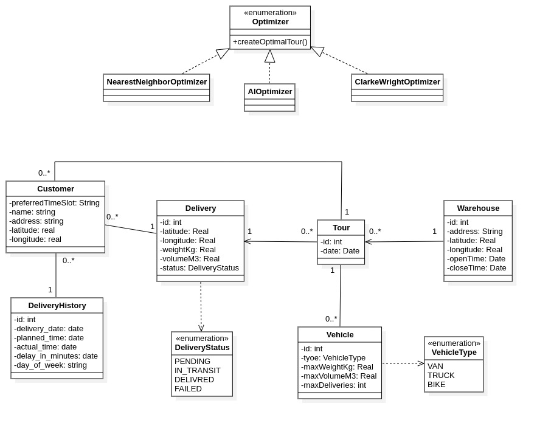

# JibMeakV2 - Delivery Optimization System

## Overview

JibMeakV2 is a Spring Boot-based delivery optimization system designed to optimize tour routes and manage deliveries efficiently. The system leverages tour optimization algorithms (including AI-powered solutions) and integrates with OpenAI and DeepSeek APIs for intelligent route planning. It's built with a focus on scalability, performance, and easy integration with external delivery management services.

---

## Class Diagram



---

## Project Folder Structure

```
JibMeakV2/
├── src/
│   ├── main/
│   │   ├── java/com/taxist/JibMeakV2/
│   │   │   ├── JibMeakV2AppApplication.java       # Main Spring Boot application entry point
│   │   │   ├── algo/
│   │   │   │   ├── Optimizer.java                 # Interface for tour optimization algorithms
│   │   │   │   ├── NearestNeighborOptimizer.java  # Nearest Neighbor optimization strategy
│   │   │   │   └── AIOptimizer.java               # AI-powered optimization strategy
│   │   │   ├── Config/
│   │   │   │   └── AppConfig.java                 # Application configuration beans
│   │   │   ├── controller/
│   │   │   │   ├── CustomerController.java        # REST endpoints for customer management
│   │   │   │   ├── DeliveryController.java        # REST endpoints for delivery management
│   │   │   │   ├── DeliveryHistoryController.java # REST endpoints for delivery history
│   │   │   │   ├── TourController.java            # REST endpoints for tour management
│   │   │   │   ├── VehicleController.java         # REST endpoints for vehicle management
│   │   │   │   └── WarehouseController.java       # REST endpoints for warehouse management
│   │   │   ├── dto/
│   │   │   │   ├── CustomerDTO.java               # Data Transfer Object for Customer
│   │   │   │   ├── DeliveryDTO.java               # Data Transfer Object for Delivery
│   │   │   │   ├── DeliveryHistoryDTO.java        # Data Transfer Object for Delivery History
│   │   │   │   ├── TourDTO.java                   # Data Transfer Object for Tour
│   │   │   │   ├── TourOptimizationDTO.java       # Data Transfer Object for Tour Optimization
│   │   │   │   ├── TourStatisticsDTO.java         # Data Transfer Object for Tour Statistics
│   │   │   │   ├── VehicleDTO.java                # Data Transfer Object for Vehicle
│   │   │   │   └── WarehouseDTO.java              # Data Transfer Object for Warehouse
│   │   │   ├── mapper/
│   │   │   │   ├── CustomerMapper.java            # MapStruct mapper for Customer entity
│   │   │   │   ├── DeliveryHistoryMapper.java     # MapStruct mapper for Delivery History entity
│   │   │   │   ├── DeliveryMapper.java            # MapStruct mapper for Delivery entity
│   │   │   │   ├── TourMapper.java                # MapStruct mapper for Tour entity
│   │   │   │   ├── VehicleMapper.java             # MapStruct mapper for Vehicle entity
│   │   │   │   └── WarehouseMapper.java           # MapStruct mapper for Warehouse entity
│   │   │   ├── model/
│   │   │   │   ├── Customer.java                  # Customer entity model
│   │   │   │   ├── Delivery.java                  # Delivery entity model
│   │   │   │   ├── DeliveryHistory.java           # Delivery History entity model
│   │   │   │   ├── Tour.java                      # Tour entity model
│   │   │   │   ├── Vehicle.java                   # Vehicle entity model
│   │   │   │   ├── Warehouse.java                 # Warehouse entity model
│   │   │   │   └── enums/                         # Enumeration classes
│   │   │   ├── repository/
│   │   │   │   ├── CustomerRepository.java        # Spring Data JPA repository for Customer
│   │   │   │   ├── DeliveryHistoryRepository.java # Spring Data JPA repository for Delivery History
│   │   │   │   ├── DeliveryRepository.java        # Spring Data JPA repository for Delivery
│   │   │   │   ├── TourRepository.java            # Spring Data JPA repository for Tour
│   │   │   │   ├── VehicleRepository.java         # Spring Data JPA repository for Vehicle
│   │   │   │   └── WarehouseRepository.java       # Spring Data JPA repository for Warehouse
│   │   │   ├── service/
│   │   │   │   ├── Impl/
│   │   │   │   │   ├── CustomerServiceImpl.java    # Customer service implementation
│   │   │   │   │   ├── DeliveryHistoryServiceImpl.java # Delivery History service implementation
│   │   │   │   │   ├── DeliveryServiceImpl.java    # Delivery service implementation
│   │   │   │   │   ├── TourServiceImpl.java        # Tour service implementation
│   │   │   │   │   ├── VehicleServiceImpl.java     # Vehicle service implementation
│   │   │   │   │   └── WarehouseImpl.java          # Warehouse service implementation
│   │   │   │   └── interfaces/                    # Service interface definitions
│   │   │   └── utils/
│   │   │       ├── DeliveryValidationUtils.java   # Utility class for delivery validation
│   │   │       ├── DistanceCalculator.java        # Utility class for distance calculations
│   │   │       ├── TourValidationUtils.java       # Utility class for tour validation
│   │   │       ├── VehicleConstraints.java        # Utility class for vehicle constraints
│   │   │       ├── VehicleValidationUtils.java    # Utility class for vehicle validation
│   │   │       └── WarehouseValidationUtils.java  # Utility class for warehouse validation
│   │   └── resources/
│   │       ├── application.yml                    # Default application configuration
│   │       ├── application-dev.yml                # Development environment configuration
│   │       ├── application-qa.yml                 # QA environment configuration
│   │       └── db/
│   │           └── changelog/
│   │               ├── 001-create-vehicles-table.xml
│   │               ├── 002-create-warehouse-table.xml
│   │               ├── 003-create-tour-table.xml
│   │               ├── 004-create-delivery-table.xml
│   │               ├── 005-create-costumer-table.xml
│   │               ├── 006-add-costumer-fk-to-delivery.xml
│   │               ├── 007-create-delivery-history-table.xml
│   │               ├── 008-refactor-remove-location-from-delivery.xml
│   │               ├── 010-add-column-status-to-tour.xml
│   │               └── changelog-master.xml
│   └── test/
│       └── java/com/taxist/JibMeakV2/
│           ├── JibMeakV2AppApplicationTests.java  # Application unit tests
│           ├── TestDataFactory.java               # Test data factory for unit tests
│           └── TourOptimizationIntegrationTest.java # Integration tests for tour optimization
├── pom.xml                                         # Maven configuration file
├── mvnw                                            # Maven wrapper script (Linux/Mac)
├── mvnw.cmd                                        # Maven wrapper script (Windows)
└── HELP.md                                         # Help documentation

```

---

## Key Features

- **Tour Optimization**: Multiple optimization strategies including Nearest Neighbor and AI-powered algorithms
- **Delivery Management**: Comprehensive delivery tracking and management system
- **Vehicle Management**: Manage fleet vehicles with constraints and capacity limits
- **Warehouse Management**: Support for multiple warehouse locations
- **Customer Management**: Customer information and delivery history tracking
- **AI Integration**: Integration with OpenAI and DeepSeek for intelligent route optimization
- **RESTful APIs**: Comprehensive REST API endpoints for all resources
- **Database Migration**: Liquibase-based database version control
- **API Documentation**: SpringDoc OpenAPI integration for automatic Swagger documentation

---

## Class Diagram


*Note: Please add the class diagram image at `./docs/class-diagram.png`*

---

## Technology Stack & Dependencies

### Core Framework
- Spring Boot 3.5.7
- Spring Data JPA
- Spring Web (RESTful services)
- Spring Validation

### Database & Migration
- H2 Database (runtime)
- Liquibase 4.27.0 (database schema versioning)

### AI Integration
- Spring AI Starter Model OpenAI
- Spring AI Starter Model DeepSeek

### Object Mapping & Serialization
- MapStruct 1.6.3 (entity-DTO mapping)
- Lombok (boilerplate reduction)

### API Documentation
- SpringDoc OpenAPI Starter WebMVC UI 2.2.0 (Swagger/OpenAPI documentation)

### Development Tools
- Spring Boot DevTools (development productivity)
- Maven 3.x (build automation)

### Testing
- Spring Boot Starter Test (unit and integration tests)

### Additional Utilities
- Spring Boot Actuator (application monitoring and management)

---

## Getting Started

### Prerequisites
- Java 17 or higher
- Maven 3.6 or higher
- Git

### Installation

1. Clone the repository:
```bash
git clone https://github.com/jad-png/JibMeak_V2.git
cd JibMeakV2
```

2. Build the project:
```bash
./mvnw clean install
```

3. Run the application:
```bash
./mvnw spring-boot:run
```

The application will start on `http://localhost:8080` by default.

### Environment Configuration

Set your environment variables for AI providers:
- `SPRING_AI_OPENAI_API_KEY`: Your OpenAI API key
- Other configuration options can be set in `application.yml` or environment-specific profiles

### Available Profiles
- `dev`: Development environment
- `qa`: Quality Assurance environment
---

## API Endpoints

### Customer Management
- `GET /api/customers` - List all customers
- `POST /api/customers` - Create a new customer
- `GET /api/customers/{id}` - Get customer by ID
- `PUT /api/customers/{id}` - Update customer
- `DELETE /api/customers/{id}` - Delete customer

### Vehicle Management
- `GET /api/vehicles` - List all vehicles
- `POST /api/vehicles` - Create a new vehicle
- `GET /api/vehicles/{id}` - Get vehicle by ID
- `PUT /api/vehicles/{id}` - Update vehicle
- `DELETE /api/vehicles/{id}` - Delete vehicle

### Warehouse Management
- `GET /api/warehouses` - List all warehouses
- `POST /api/warehouses` - Create a new warehouse
- `GET /api/warehouses/{id}` - Get warehouse by ID
- `PUT /api/warehouses/{id}` - Update warehouse
- `DELETE /api/warehouses/{id}` - Delete warehouse

### Delivery Management
- `GET /api/deliveries` - List all deliveries
- `POST /api/deliveries` - Create a new delivery
- `GET /api/deliveries/{id}` - Get delivery by ID
- `PUT /api/deliveries/{id}` - Update delivery
- `DELETE /api/deliveries/{id}` - Delete delivery

### Tour Management
- `GET /api/tours` - List all tours
- `POST /api/tours` - Create a new tour
- `GET /api/tours/{id}` - Get tour by ID
- `PUT /api/tours/{id}` - Update tour
- `DELETE /api/tours/{id}` - Delete tour
- `POST /api/tours/optimize` - Optimize tour route

### Delivery History
- `GET /api/delivery-history` - List all delivery history records
- `GET /api/delivery-history/{id}` - Get delivery history by ID

---

## Architecture Overview

### Layered Architecture

1. **Controller Layer**: Handles HTTP requests and responses
2. **Service Layer**: Contains business logic and orchestration
3. **Repository Layer**: Manages database operations using Spring Data JPA
4. **Model Layer**: Defines entity classes and data structures
5. **Utility Layer**: Provides helper functions for validation, calculations, and constraints

### Optimization Strategy Pattern

The system uses the **Strategy Pattern** for tour optimization:
- **Optimizer Interface**: Defines the optimization contract
- **NearestNeighborOptimizer**: Greedy algorithm implementation
- **AIOptimizer**: AI-powered optimization using external APIs

---

## Database Schema

The application uses Liquibase for database versioning. Key tables include:

- `vehicles` - Vehicle information and properties
- `warehouses` - Warehouse locations
- `tours` - Tour records with optimization status
- `deliveries` - Individual delivery items
- `customers` - Customer information
- `delivery_history` - Historical records of deliveries

---

## Configuration

### Application Configuration Files

- `application.yml` - Global configuration
- `application-dev.yml` - Development-specific settings
- `application-qa.yml` - QA-specific settings

### Key Configuration Options

```yaml
app:
  optimizer:
    active: "nno"  # Optimizer strategy: "nno" for Nearest Neighbor, "ai" for AI-based
  ai:
    provider: "openai"  # AI provider: "openai" or "deepseek"
```

---

## Testing

Run the test suite:
```bash
./mvnw test
```

Run a specific test:
```bash
./mvnw test -Dtest=TourOptimizationIntegrationTest
```

Test classes:
- `JibMeakV2AppApplicationTests` - Application-level unit tests
- `TourOptimizationIntegrationTest` - Integration tests for tour optimization
- `TestDataFactory` - Factory for creating test data

---

## API Documentation

Once the application is running, access the interactive API documentation at:
- Swagger UI: `http://localhost:8080/swagger-ui.html`
- OpenAPI JSON: `http://localhost:8080/v3/api-docs`

---

## Build and Deployment

### Building the Application

```bash
./mvnw clean package
```

This creates an executable JAR file at `target/JibMeakV2-0.0.1-SNAPSHOT.jar`

### Running the JAR

```bash
java -jar target/JibMeakV2-0.0.1-SNAPSHOT.jar
```

### Docker Build (Optional)

```bash
./mvnw spring-boot:build-image
```

---

## Contributing

Contributions are welcome! Please follow these steps:

1. Fork the repository
2. Create a feature branch (`git checkout -b feature/amazing-feature`)
3. Commit your changes (`git commit -m 'Add some amazing feature'`)
4. Push to the branch (`git push origin feature/amazing-feature`)
5. Open a Pull Request

---

## License

This project is licensed under the MIT License - see the LICENSE file for details.

---

## Support

For support and questions, please open an issue on the GitHub repository or contact the development team.

---

## Project Maintainer

**Maintainer**: jad-png  
**Repository**: [JibMeak_V2](https://github.com/jad-png/JibMeak_V2)

---

## Changelog

### Version 0.0.1-SNAPSHOT
- Initial project setup with Spring Boot 3.5.7
- Core entities and repositories
- RESTful API endpoints
- Tour optimization algorithms
- AI integration (OpenAI and DeepSeek)
- Database schema with Liquibase migrations

